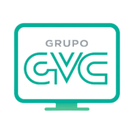

<h1 align="center">
  <br>
  
  <br>
  GVC Display
  <br>
</h1>

<p align="center">
  Sistema corporativo de sinalização digital — gerencie Smart TVs e apresentações a partir de um único painel web.
</p>

<p align="center">
  
  
  
  
  
</p>

---

## Descrição do Projeto

O GVC Display permite que o administrador organize imagens, vídeos e páginas em playlists e as exiba em qualquer número de Smart TVs distribuídas pela empresa — tudo controlado por um painel web centralizado.

Cada TV acessa uma URL simples pelo próprio navegador e fica em modo apresentação em tela cheia. Quando o admin troca o conteúdo, a TV atualiza automaticamente em até **15 segundos**, sem nenhuma interação manual.

> **Produção:** https://display.drc-gvc.tech  
> **Repositório:** https://github.com/GrupoGVC/gvc-display

---

## Funcionalidades do Projeto

**Painel administrativo**
- Login seguro com JWT
- Cadastro de TVs por nome, local e grupo (setor, andar, ambiente)
- Upload de imagens (JPG, PNG, GIF, WebP) e vídeos (MP4, WebM) até 100 MB
- Criação e edição de playlists com múltiplos itens
- Duração individual por item (em segundos)
- Reordenação por drag and drop
- Duplicar playlists existentes
- Definir playlist padrão (exibida quando nenhuma outra está atribuída)
- Agendamento de playlists por data e horário
- Broadcast: enviar playlist para todas as TVs, um grupo ou uma TV específica
- Dashboard com status online/offline de cada TV em tempo real
- Log de atividades administrativas

**Player da TV**
- Exibição em tela cheia, sem menus ou botões visíveis
- Suporte a imagens, vídeos e páginas HTML (iframe)
- Atualização automática ao detectar mudança de conteúdo
- Reconexão automática em caso de queda de internet
- Tela de pareamento com código de 6 dígitos no primeiro acesso

**Pareamento de TVs**
- TV gera automaticamente um código de 6 dígitos ao abrir pela primeira vez
- Admin digita o código no painel para vincular a TV
- Após pareada, a TV sempre carrega a playlist correta automaticamente
- Despareamento pelo painel, com retorno imediato à tela de código

---

## Testes de Software

| Tipo | O que foi validado |
|---|---|
| Funcional | Pareamento e despareamento de TVs, troca de playlist em tempo real, broadcast para grupos |
| Autenticação | JWT HS256: expiração, assinatura inválida, token ausente retornam 401 |
| Upload | MIME type validado no servidor; arquivos acima de 100 MB rejeitados |
| Multi-TV | Várias TVs simultâneas via abas anônimas (cookies isolados) |
| Reconexão | Player continua exibindo o último slide durante queda de rede; retoma no próximo heartbeat |
| Compatibilidade | Autoplay de vídeo com `muted + playsinline` testado em Chrome, Edge e navegadores de Smart TV |

---

## Tecnologias e Linguagens

- **PHP 8.2** — backend MVC sem framework externo (sem Composer)
- **MariaDB 10.x** — banco de dados relacional
- **JavaScript ES2020** — frontend (Vanilla JS, sem transpilação)
- **HTML5 / CSS3** — views e estilos

---

## Bibliotecas e Frameworks

- **Bootstrap 5.3** — grid e componentes do painel administrativo
- **Bootstrap Icons 1.11** — ícones do painel
- **Google Fonts** — Inter (player) e Lato (login/admin)
- **PDO** — acesso ao banco (nativo do PHP)

---

## Pré-requisitos e Instalação

**Pré-requisitos**
- XAMPP com PHP 8.2+ e MariaDB na porta 3307
- Git

**1. Clonar o repositório**
```bash
cd C:\xampp\htdocs
git clone https://github.com/GrupoGVC/gvc-display.git
cd gvc-display
```

**2. Criar o arquivo de configuração**
```bash
copy .env.example .env
```

Edite o `.env` com os dados do seu ambiente:
```env
DB_HOST=127.0.0.1
DB_PORT=3307
DB_NAME=db_gvc_display
DB_USER=root
DB_PASS=

JWT_SECRET=coloque-aqui-uma-string-aleatoria-longa
APP_BASE_PATH=/gvc-display
```

**3. Criar o banco de dados**

Abra o MySQL Workbench (porta **3307**) e execute o arquivo `db_gvc_display.sql`.  
Ou via terminal:
```bash
"C:\xampp\mysql\bin\mysql.exe" -h 127.0.0.1 -P 3307 -u root < db_gvc_display.sql
```

**4. Iniciar o XAMPP** (Apache + MySQL)

---

## Instruções de Uso

**Endereços após a instalação**

| URL | O que abre |
|---|---|
| `http://localhost/gvc-display/` | Painel administrativo |
| `http://localhost/gvc-display/login` | Tela de login |
| `http://localhost/gvc-display/tv` | Player da TV |
| `http://localhost/gvc-display/tv/{slug}` | Player de uma TV específica |

**Login padrão**
```
E-mail: admin@gvc.com
Senha:  admin123
```
> Troque a senha após o primeiro acesso: ícone de usuário → "Alterar senha".

**Fluxo básico de uso**

1. Acesse o painel e faça login
2. Em **Mídias**, faça upload das imagens e vídeos
3. Em **Playlists**, crie uma apresentação e adicione os itens com duração
4. Em **Dispositivos**, cadastre uma TV e clique em **Parear**
5. Na Smart TV, abra `http://display.drc-gvc.tech/tv` e aguarde o código aparecer
6. No painel, digite o código — a TV começa a exibir a playlist imediatamente

**Simulando várias TVs no navegador**
```
Aba normal     → Painel admin
Aba anônima 1  → /tv  (simula TV 1, cookies isolados)
Aba anônima 2  → /tv  (simula TV 2, cookies isolados)
```

---

## Documentação

| Tecnologia | Link |
|---|---|
| PHP 8.2 | https://www.php.net/releases/8.2/ |
| MariaDB | https://mariadb.com/kb/en/documentation/ |
| PDO | https://www.php.net/manual/pt_BR/book.pdo.php |
| Bootstrap 5.3 | https://getbootstrap.com/docs/5.3/ |
| Bootstrap Icons | https://icons.getbootstrap.com |
| JWT (RFC 7519) | https://jwt.io/introduction |
| Web Autoplay Policy | https://developer.chrome.com/blog/autoplay |

---

## Licença

Projeto proprietário — GrupoGVC. Todos os direitos reservados.  
Uso interno exclusivo. Redistribuição não autorizada.

---

## Contribuição

Este é um projeto interno do GrupoGVC. Contribuições externas não estão abertas no momento.

Colaboradores internos devem seguir o fluxo abaixo.

---

## Gitflow

**Nomenclatura de branches**
```
main              → produção (deploy automático via git reset --hard)
estruturaMVC      → branch de desenvolvimento principal
feature/nome      → novas funcionalidades
hotfix/nome       → correções urgentes em produção
```

**Fluxo de trabalho**
```bash
# Criar branch de feature
git checkout -b feature/minha-funcionalidade

# Commits semânticos
git commit -m "feat: adiciona agendamento por horário"
git commit -m "fix: corrige loop de login no Safari"
git commit -m "refactor: extrai lógica de hash para PlaylistModel"
git commit -m "docs: atualiza README com instruções de deploy"

# Abrir Pull Request para estruturaMVC
# Após revisão e merge → cherry-pick ou merge para main
```

**Deploy em produção**
```bash
cd /var/www/gvc-display
git fetch origin
git reset --hard origin/main
chmod -R 775 uploads/
chown -R www-data:www-data uploads/
```
---

<p align="center">
  Desenvolvido pelo <a href="https://grupogvc.eco.br">Grupo GVC</a>
</p>